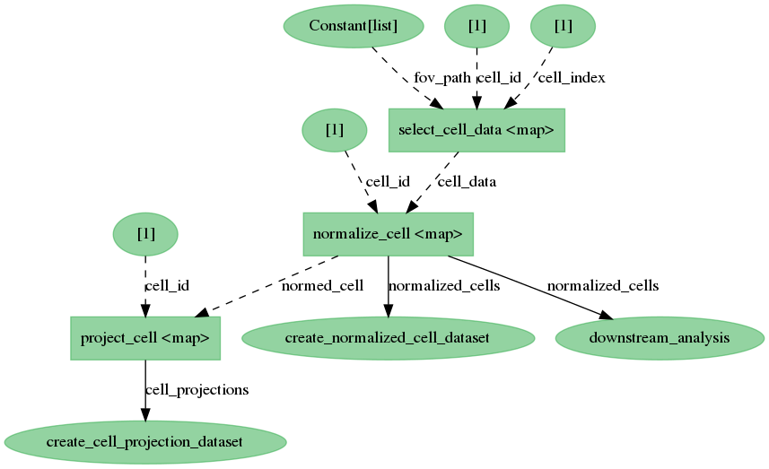

# Distributed Ecosystem Tools and Planning
Planned tools for making pipeline development and data reproduction easier

## Goals

> "Users, developers, scientists, etc. should be able to run the same pipeline on their
> laptop or a distributed cluster with local or remote data* and the products of the
> pipeline should be tied to the code and be 'publish ready.'"

-- Some scientist probably (it was [Rory](https://github.com/donovanr))

_* depending on the distributed cluster configuration, data must be local or remote but
usually cannot be both_

### Bullet Points

* iterative development should be simple
* sharing data should be easy (internally or externally)
* data is linked to the code that produced it
* data organization is (partially) managed for the user
* scaling from laptop to cluster should be a non-issue

### A Brief Discussion on Why

Why do we care about those bullets? If the goal is "easily reproducible publishable
science" -- wouldn't you also want to make it easy to test and document
your workflow? Wouldn't it be nice to tie generated research objects (results, plots,
etc.) to the code that produced it? And, wouldn't it be nice to make it so that
your workflow can run on some other infrastructure?

That isn't even counting the value of doing this for ourselves. All of these things
generally make iterative development easier in the long run when we inevitably need to
change the data source, or one of the tasks in the workflow, or someone asks _how_ a
plot was made, or we realize we can save money by moving from one set of infrastructure
pieces to another.

## Psuedo-code
The following psuedo-code will show the effect of these tools on a common workflow for
many scientists and engineers in the institute. The workflow in general form can be
seen as:

1. selecting data you are interested in from an image
2. normalizing that data
3. storing projects or other representations of each selected datum
4. downstream analysis of normalized data as a different thread in the DAG
5. multiple processes to create collections / manifests of results (datasets)

As a DAG this pseudo-code looks like:



_The `[1]` representations are lists of `1` added as parameters to the function to map
across. In an actual example these would be much larger datasets. See below for more
discussion._

The following is Python psuedo-code for the above workflow description:
```python
from aicsimageio import AICSImage, types
import dask.array as da
import pandas as pd
from prefect import Flow, task

# A repo that currently doesn't exist
from databacked import (
    # Developer chooses which dataset level result they want
    LocalDatasetResult, QuiltDatasetResult, FMSDatasetResult,
    # Developer chooses which single item level result they want
    # LocalResult and S3Result are just routers to base Prefect objects
    LocalResult, S3Result, FMSResult,
    # Various serializers for common data types we work with
    ArrayToOmeTiff, ArrayToDefaultWriter
)

###############################################################################


@task
def select_cell_data(fov_path: types.FSSpecLike, cell_index: int) -> da.Array:
    """
    Loads the image from any FSSpec like path and returns just the CZYX cell data.
    """
    img = AICSImage(fov_path)
    # ...
    return cell_data


@task(
    result=LocalResult(
        dir="local_staging/normalized_cells/",
        serializer=ArrayToOmeTiff(dimensions="CZYX", channel_names=["a", "b", "..."]),
    ),
    target=lambda **kwargs: "{}.ome.tiff".format(kwargs.get("cell_id")),
)
def normalize_cell(cell_id: int, cell_data: da.Array) -> da.Array:
    """
    Normalizes the array provided. Returns a dask array.

    The serializer object knows how to receive a dask array and return the bytes for an
    OME-TIFF.

    The result object knows to take the bytes and store them at some location for
    check-pointing / persistence.
    """
    # ...
    return normed_cell


@task(
    result=QuiltDatasetResult(
        name="aics/my-project/normalized-cells",
        readme="/path/to/file",
        filepath_columns=["normalized_cell_path"],
        metadata_columns=["cell_id", "cell_index"],
    )
)
def create_normalized_cell_dataset(**dataset_metadata: Any) -> pd.DataFrame:
    """
    Create or formalize some dataset as a dataframe.

    This is basically the original "datastep" framework as a task.
    I.E.:
        store a manifest during you step
        -> validate and upload it to some storage system after

    See actk for an example of well formed datastep repo.
    https://github.com/AllenCellModeling/actk

    Unlike original datastep, you do not need to save the dataframe to a csv / parquet
    file. The "DatasetResult" handler will deal with serialization.
    """
    # ... create a dataset manifest of the cell projections
    return dataset


@task(
    result=LocalResult(
        dir="local_staging/normalized_cells/",
        serializer=ArrayToDefaultWriter,
    ),
    target=lambda **kwargs: "{}.png".format(kwargs.get("cell_id")),
)
def project_cell(cell_id: int, normed_cell: da.Array) -> da.Array:
    """
    Max projects the array provided. Returns a dask array.

    The serializer object knows how to receive a dask array and return the bytes for a
    PNG.

    The result object knows to take the bytes and store them at some location for
    check-pointing / persistence.
    """
    # ... do some projection
    return projection


@task(
    result=QuiltDatasetResult(
        name="aics/my-project/single-cell-projections",
        readme="/path/to/file",
        filepath_columns=["cell_projection_path"],
        metadata_columns=["cell_id", "cell_index"],
    )
)
def create_cell_projection_dataset(**dataset_metadata: Any) -> pd.DataFrame:
    """
    Create or formalize some dataset as a dataframe.

    This is basically the original "datastep" framework as a task.
    I.E.:
        store a manifest during you step
        -> validate and upload it to some storage system after

    See actk for an example of well formed datastep repo.
    https://github.com/AllenCellModeling/actk

    Unlike original datastep, you do not need to save the dataframe to a csv / parquet
    file. The "DatasetResult" handler will deal with serialization.
    """
    # ... create a dataset manifest of the cell projections
    return dataset


@task
def downstream_analysis(normalized_cells: List[da.Array]) -> Any:
    """
    Some downstream analysis to simply show the point that this is a true DAG.

    You could attach a result object to this as well if you wanted checkpointing or
    persistence.
    """
    # ... analysis code
    return research_object

###############################################################################

# assume we have some dataset as a dataframe
# dataset = pd....

with Flow("example_workflow") as flow:
    selected_cells = select_cell_data.map(
        dataset.fov_path,
        dataset.cell_index,
    )

    normalized_cells = normalize_cell.map(
        dataset.cell_id,
        selected_cells,
    )

    normalized_cell_dataset = create_normalized_cell_dataset(
        dataset.cell_id,
        dataset.cell_index,
        normalized_cells,
        # some other metadata
    )

    cell_projections = project_cell.map(
        dataset.cell_id,
        normalized_cells,
    )

    cell_proj_dataset = create_cell_projection_dataset(
        dataset.cell_id,
        dataset.cell_index,
        cell_projections,
        # some other metadata
    )

    downstream_analysis(normalized_cells)

flow.run()
```

### End Result of Pseudo-code

With current psuedo-code this results in:
1. Scientist doesn't have to care about file IO due to result serializers
2. Results are _**checkpointed**_ at: `local_staging/` from current working directory
3. To move from local to remote they can find-replace `LocalResult` w/ `S3Result`*
4. To change where to store dataset level results (manifests), find-replace also works

_* I believe S3Result needs to be prefixed with s3://bucket-header, but still minimal
changes to move from local to remote_

#### Checkpointing

A common concern over pipeline development is how a pipeline deals with interrupts,
restarts, etc. Checkpointing is done _by_ Prefect for us with the `target` keyword.
What this means in practice is that if the workflow was to stop for any reason and has
already stored results of a task and will simply check the target location of the result
during a rerun and _deserialize_ the bytes when needed.

To change this behavior to _always_ save the result and not check the target, the
user simply has to change `target` to `location`.

If a user wants to keep using checkpointing but want's to clear their cache they
simply remove the file from disk.

This is built into Prefect.

#### Other Comments

The example above utilizes a custom serializer to go from array to bytes but in many
cases there is value in the user fully serializing the object in their function so that
they can return a path like object back from their task. In this case there is an
opportunity to contribute back to Prefect core (as it is entirely open source) and add a
`S3FromPathResult` object or a parameter `from_path=True` to the existing `S3Result`.

## Technology Choices

This next section will go into the reasons why certain technologies were made the way
they were and most importantly, _how_ these technologies work well together.

1. [AICSImageIO](#aicsimageio)
2. [Dask](#dask)
3. [Prefect](#prefect)
4. [Quilt](#quilt)

### AICSImageIO

[AICSImageIO](http://github.com/AllenCellModeling/aicsimageio) is the core image
reading and writing library for the institute. That is it, short and sweet.

But it does some neat stuff for us that makes it work well with the rest of the
technologies.

Specifically it uses _Dask_ under the hood to allow for any size image to be read and
manipulated. Dask has many supporting libraries for `array`, `dataframe`, and `bag`
style objects but specifically, AICSImageIO utilizes `dask.array` and `dask.delayed`.

In practice this simply means we construct a "fake" array that chunks of which can be
loaded at any time and we inform Dask _how_ to load those chunks. So an "out-of-memory"
image for us really means -- "A fake array that knows how to load parts of the image on
request."*

This feature is important to mention but is relatively minor for the purpose of this
document (until we start processing hundred GB size timeseries files). The most
beneficial _planned_ aspect of AICSImageIO to pipeline development is the ability to
read local or remote files under the same unified API. If someone wanted to provide
a path to an file on S3 (i.e. `s3://my-bucket/my-file.ome.tiff`), even though it is
remote, it would _still_ know how to create and read this "fake" or fully in-memory
array.

_* The chunksize of the "fake" (delayed) array matters a lot and in most cases it is
better to simply read the entire image into memory in a single shot rather than utilize
this functionality. But it is important that we build it in anyway to make it possible
for large image reading and because future formats designed for chunked reading are on
their way._

The most important aspects of AICSImageIO in regards to pipeline development is that it
provides a unified API for:
* reading any size file
* reading any of the supported file formats
* reading local or remote
* interacting with common metadata pieces across formats
* writing to local or remote
* writing to a common standard format

### Dask

[Dask](dask.org) provides a whole host of useful things to the Python ecosystem. I would
highly recommend looking at their website for more details but for now I will give the
very brief rundown of why Dask for us.

As written in the [AICSImageIO](#aicsimageio) section, Dask provides a near identical
`numpy.ndarray` (`dask.array`) interface that we can use to interact with
too-large-for memory images as well as distribute out computation against those images.

Additionally, Dask provides a near identical `pandas.DataFrame` (`dask.dataframe`)
interface that can help achieve similar goals with dataframe objects that are
too-large-for-memory datasets as well.

Finally, and crucially, all of this functionality can have computations ran against the
Dask native objects or just run multiple tasks in parallel using their `distributed`
library which makes it easy to distribute work out to:
* [a single machine](https://docs.dask.org/en/latest/setup/single-distributed.html)
* [an HPC cluster](https://docs.dask.org/en/latest/setup/hpc.html)*
* [a cloud deployment](https://cloudprovider.dask.org/en/latest/) (see my minimal
[fargate example](https://github.com/JacksonMaxfield/fargate-example/blob/master/prefect_example.py))

_* Unfortunately we have had difficulty utilizing the SLURM cluster to it's fullest
with Dask. It seems to be a combination of many different things: our Isilon read /
write times, the SLURM cluster's original setup (most recently used vs round robin), the
institute network, heavy Python tasks (memory transfer between workers), etc. I am not
discouraged by this however, I would simply say that whenever we move to cloud
deployments and storage, Dask is a good solution to use as it works well with the other
technology choices and from my own experiments and work with Theriot Lab, Dask and
FargateCluster work incredibly well together. I would highly encourage checking out my
[fargate example made for the Theriot Lab](https://github.com/JacksonMaxfield/fargate-example)._

What does this all mean for workflow development:
* easy to create out-of-memory objects w/ similar APIs to already known libraries
* easy to distribute computations across out-of-memory datasets and arrays
* moving from local to cloud for computation can be done by replacing a single object*

_* Again, this assumes that when working on the cloud, the data is accessible to the
cloud deployment._

### Prefect

[Prefect](https://github.com/prefecthq/prefect) makes developing DAGs much much easier
in pure Python than any other DAG library I have interacted with (so far). In general,
I recommend reading their
[Why Not Airflow](https://docs.prefect.io/core/getting_started/why-not-airflow.html#dynamic-workflows) documentation.

In short for scientific pipeline development there were two key things we cared about
_in addition to everything else Prefect offers us_:

* We wanted a DAG development framework that could "deploy" DAGs to a central manager /
server / UI
* We wanted a DAG development frame that could run entire DAGs on request with minimal
hassle

#### Server / UI

Airflow offers this, many DAG frameworks now offer this. For us this is somewhat
required both for monitoring all the various pipelines and the entire system but
additionally have the ability for non-computational scientists to trigger workflows by
themselves without the assistance of engineers.

> "It would be great if a person on the microscopy team could trigger a workflow to
> process a specific CSV dataset rather than asking one of us to do it or asking them
> to open a terminal and install all of this stuff."

#### On-Demand Full DAG Runs

One of the frustrations for us originally was how hard we felt it was to simply just
utilize our cluster and run a workflow in its entirety on the same dataset but with
with different parameter sets. So we wanted a system that was basically pure Python
enough that we could basically have the same bin script level of functionality to kick
off pipeline runs with various parameters locally as well.

Additionally, many of us have _always_ been concerned about the question "well what
happens when we update a very upstream task of our workflow -- how long will it take to
reprocess our entire dataset?"

By choosing a workflow development framework that allows us to kick off workflow runs
just like a normal bin script would it makes it feel (and is) more iterative. If we
want to compare the outputs of the same workflow but with an upstream task using
version 1 vs version 2 of an algorithm that _should_ be as simple as kicking off the
bin script once, changing which import you use, then kicking off the bin script again*.

_* There are many more things to do for a "production" setup -- usually, updating the
tests, the docker image, etc. But this requirement is specifically to address iterative
scientific workflow development._

#### Separation of Execution and Workflow

Looking at our original goals there was a key point of being able to run workflows on a
local machine or on a cloud deployment -- Prefect solves this by having builtin
separation of workflow management and actual execution. What this means is that to
parallelize an entire workflow you can provide an executor to the workflow of
indicating the system that should execute this workflow. Given that Prefect has deep
ties to Dask, this means you can provide all of the options listed in the [Dask](#dask)
section for cluster deployments to Prefect and it will parallelize to the best of it's
ability.

One additional benefit of this behavior is that instead of making a roundtrip to the
workflow triggering machine with the intermediate results of the workflow, it will
simply tell "worker a" needs to pass "worker b" the intermediate results for it to
continue with the DAG. And less roundtrips to the triggering machine is always a good
thing -- especially with large datasets.

### Quilt

...

## The Last-Mile Library

"databacked" -- or whatever you want to name it.

1. "DatasetResult" Handlers
2. "ArrayTo*" Serializers

### DatasetResult Handlers

...

### ArrayTo Serializers

...


## Benefits Over Datastep
