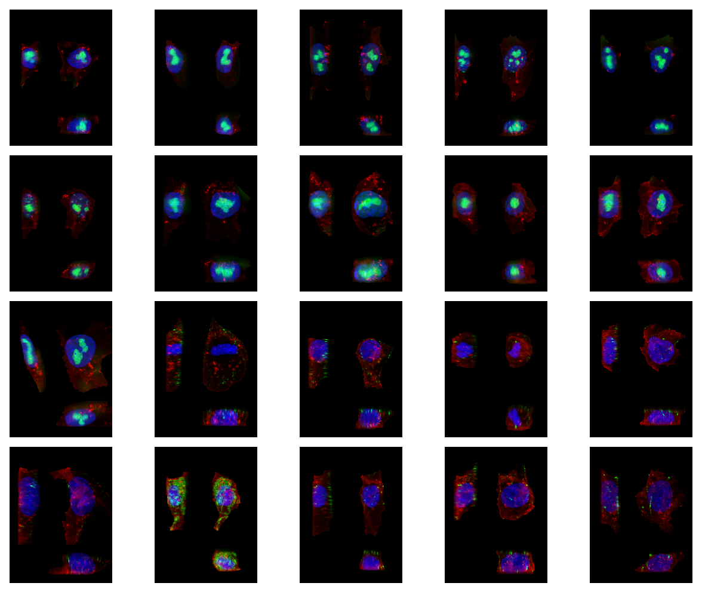

# Distributed Ecosystem Tools and Planning
Planned tools for making pipeline development and data reproduction easier

#### Index
1. [Goals](#goals)
2. [Psuedo-code](#psuedo-code)
3. [Technology Choices](#technology-choices)
4. [Last-Mile Library](#the-last-mile-library)
5. [Production Configurations and Other Comments](#production-configurations)
6. [Wrap Up](#wrap-up)

## Goals

> "Users, developers, scientists, etc. should be able to run the same pipeline on their
> laptop or a distributed cluster with local or remote data* and the products of the
> pipeline should be tied to the code and be 'publish ready.'"

-- Some scientist probably (it was [Rory](https://github.com/donovanr))

_* Local and remote data usage depends on cluster configuration._

### Bullet Points

* iterative development should be simple
* sharing data should be easy (internally or externally)
* data should be linked to the code that produced it
* data organization should be (partially) managed for the user
* scaling from laptop to cluster should be a non-issue

### A Brief Discussion on Why

Why do we care about those bullets? If the goal is "easily reproducible, publishable
science" -- wouldn't you also want to make it easy to test and document
your workflow? Wouldn't it be nice to tie generated research objects (results, plots,
etc.) to the code that produced it? And, wouldn't it be nice to make it so that
your workflow can run on some other infrastructure?

All of these goals generally make internal iterative development easier in the long
run as well when we inevitably need to change the data source, change one of the tasks
in the workflow, someone asks _how_ a plot was made, or we realize we can save money by
moving from one infrastructure setup to another.

## Psuedo-code
The following psuedo-code will show the effect that these planned tools have on a
common workflow for many scientists and engineers in the institute. The workflow in a
general form:

1. selecting data you are interested in from an image
2. normalizing that data
3. storing projections or other representations of each selected datum
4. downstream analysis of normalized data as a different thread in the DAG
5. multiple processes to create collections / manifests of results (datasets)

As a DAG this pseudo-code looks like:


_This flow visualization is generated by the `example-flow.py` script. The `[1]`
representations are lists of `1` added as parameters to the function to map across. In
an actual example these would be much larger datasets. See below for more discussion._

The following is Python psuedo-code for the above workflow description:
```python
from aicsimageio import AICSImage, types
import dask.array as da
import pandas as pd
from prefect import Flow, task

# A repo that currently doesn't exist
from databacked import (
    # Developer chooses which dataset level result they want
    LocalDatasetResult, QuiltDatasetResult, FMSDatasetResult,
    # Developer chooses which single item level result they want
    # LocalResult and S3Result are just routers to base Prefect objects
    LocalResult, S3Result, FMSResult,
    # Various serializers for common data types we work with
    ArrayToOmeTiff, ArrayToDefaultWriter
)

###############################################################################


@task
def select_cell_data(
    fov_path: types.PathLike,
    cell_id: int,
    cell_index: int
) -> da.Array:
    """
    Loads the image from any FSSpec like path and returns just the CZYX cell data.
    """
    img = AICSImage(fov_path)
    # ...
    return cell_data


@task(
    result=LocalResult(
        dir="local_staging/normalized_cells/",
        serializer=ArrayToOmeTiff(dimensions="CZYX", channel_names=["a", "b", "..."]),
    ),
    target=lambda **kwargs: "{}.ome.tiff".format(kwargs.get("cell_id")),
)
def normalize_cell(cell_id: int, cell_data: da.Array) -> da.Array:
    """
    Normalizes the array provided. Returns a dask array.

    The serializer object knows how to receive a dask array and return the bytes for an
    OME-TIFF.

    The result object knows to take the bytes and store them at some location for
    check-pointing / persistence.
    """
    # ...
    return normed_cell


@task(
    result=QuiltDatasetResult(
        name="aics/my-project/normalized-cells",
        readme="/path/to/file",
        filepath_columns=["normalized_cell_path"],
        metadata_columns=["cell_id", "cell_index"],
    )
)
def create_normalized_cell_dataset(
    cell_ids: pd.Series,
    cell_indices: pd.Series,
    normalized_cells: List[da.Array]
) -> pd.DataFrame:
    """
    Create or formalize some dataset as a dataframe.

    This is basically the original "datastep" framework as a task.
    I.E.:
        store a manifest during you step
        -> validate and upload it to some storage system after

    See actk for an example of a well formed datastep repo.
    https://github.com/AllenCellModeling/actk

    Unlike original datastep, you do not need to save the dataframe to a csv / parquet
    file. The "DatasetResult" handler will deal with serialization.
    """
    # ... create a dataset manifest of the cell projections
    return dataset


@task(
    result=LocalResult(
        dir="local_staging/normalized_cells/",
        serializer=ArrayToDefaultWriter,
    ),
    target=lambda **kwargs: "{}.png".format(kwargs.get("cell_id")),
)
def project_cell(cell_id: int, normed_cell: da.Array) -> da.Array:
    """
    Max projects the array provided. Returns a dask array.

    The serializer object knows how to receive a dask array and return the bytes for a
    PNG.

    The result object knows to take the bytes and store them at some location for
    check-pointing / persistence.
    """
    # ... do some projection
    return projection


@task(
    result=QuiltDatasetResult(
        name="aics/my-project/single-cell-projections",
        readme="/path/to/file",
        filepath_columns=["cell_projection_path"],
        metadata_columns=["cell_id", "cell_index"],
    )
)
def create_cell_projection_dataset(
    cell_ids: pd.Series,
    cell_indices: pd.Series,
    cell_projections: List[da.Array]
) -> pd.DataFrame:
    """
    Create or formalize some dataset as a dataframe.

    This is basically the original "datastep" framework as a task.
    I.E.:
        store a manifest during you step
        -> validate and upload it to some storage system after

    See actk for an example of a well formed datastep repo.
    https://github.com/AllenCellModeling/actk

    Unlike original datastep, you do not need to save the dataframe to a csv / parquet
    file. The "DatasetResult" handler will deal with serialization.
    """
    # ... create a dataset manifest of the cell projections
    return dataset


@task
def downstream_analysis(normalized_cells: List[da.Array]) -> Any:
    """
    Some downstream analysis to simply show the point that this is a true DAG.

    You could attach a result object to this as well if you wanted checkpointing or
    persistence.
    """
    # ... analysis code
    return research_object

###############################################################################

# assume we have some dataset as a dataframe
# dataset = pd....

with Flow("example_workflow") as flow:
    selected_cells = select_cell_data.map(
        dataset.fov_path,
        dataset.cell_index,
    )

    normalized_cells = normalize_cell.map(
        dataset.cell_id,
        selected_cells,
    )

    normalized_cell_dataset = create_normalized_cell_dataset(
        dataset.cell_id,
        dataset.cell_index,
        normalized_cells,
        # some other metadata
    )

    cell_projections = project_cell.map(
        dataset.cell_id,
        normalized_cells,
    )

    cell_proj_dataset = create_cell_projection_dataset(
        dataset.cell_id,
        dataset.cell_index,
        cell_projections,
        # some other metadata
    )

    downstream_analysis(normalized_cells)

flow.run()
```

### End Result of Pseudo-code

With current psuedo-code this results in:
1. Scientists not needing to care about file IO due to result serializers
2. Results are _**checkpointed**_ at: `local_staging/` from current working directory
3. To move from local to remote the user can find-replace `LocalResult` w/ `S3Result`*
4. To change where to store dataset level results (manifests), find-replace also works

_* I believe S3Result needs to be prefixed with s3://bucket-header, but still minimal
changes to move from local to remote._

#### Checkpointing

A common concern over pipeline development is how a pipeline deals with interrupts,
restarts, etc. Checkpointing is done _by_ Prefect for us with the `target` keyword.
What this means in practice is that if the workflow was to stop for any reason and has
already stored the result of a task, it will simply check the target location of the
result during a rerun and _deserialize_ the bytes when needed.

To change this behavior to _always_ store the result of a task (overwrite) and not
check the target, the user simply has to change `target` to `location`.

If a user wants to keep using checkpointing but want's to clear their cache they
simply remove the file from disk.

This is built into Prefect.

#### Other Comments

The example above utilizes a custom serializer to go from array to bytes but in many
cases there is value in the user fully serializing the object in their function so that
they can return a path like object back from their task. In this case there is an
opportunity to contribute back to Prefect core (as it is entirely open source) and add a
`S3FromPathResult` object or a parameter `from_path=True` to the existing `S3Result`.

## Technology Choices

This next section will go into the reasons why certain technologies were made the way
they were and most importantly, _how_ these technologies work well together.

1. [AICSImageIO](#aicsimageio)
2. [Dask](#dask)
3. [Prefect](#prefect)
4. [Quilt](#quilt)

### AICSImageIO

[AICSImageIO](http://github.com/AllenCellModeling/aicsimageio) is the core image
reading and writing library for the institute. That is it, short and sweet.

But it does some neat stuff for us that makes it work well in combination with the
other technologies.

Specifically it uses Dask under the hood to allow for any size image to be read and
manipulated. Dask has many supporting modules for `array`, `dataframe`, and `bag`
style objects but specifically, AICSImageIO utilizes `dask.array` and `dask.delayed`.

In practice this simply means we construct a "fake" array that chunks of which can be
loaded at any time and we inform Dask _how_ to load those chunks. So an "out-of-memory"
image for us really means -- "A fake array that knows how to load parts of the image on
request."*

_* The chunksize of the "fake" (delayed) array matters a lot and in most cases it is
better to simply read the entire image into memory in a single shot rather than utilize
this functionality. But it is important that we build it in anyway to make it possible
for large image reading and because future formats designed for [chunked reading are on
their way](https://zarr.readthedocs.io/en/stable/)._

This feature is important to mention but is relatively minor for the purpose of this
document (until we start processing hundred GB size timeseries files). The most
beneficial _planned_ aspect of AICSImageIO to pipeline development is the ability to
read local or remote files under the same unified API. If someone wanted to provide
a path to an file on S3 (i.e. `s3://my-bucket/my-file.ome.tiff`), even though it is
remote, it would still know how to create and read this "fake" or fully in-memory
array. (See [FSSpec](https://github.com/intake/filesystem_spec) for more details)

The most important aspects of the planned AICSImageIO library upgrades or currently
available pieces in regards to pipeline development is that it provides a unified API
for:
* reading any size file
* reading any of the supported file formats
* reading local or remote data
* interacting with common metadata across formats
* writing to local or remote files
* writing to a common standard format

### Dask

[Dask](dask.org) provides a whole host of useful things to the Python ecosystem. I would
highly recommend looking at their website for more details but for now I will give the
very brief rundown of why Dask for us.

As written in the [AICSImageIO](#aicsimageio) section, Dask provides a near identical
`numpy.ndarray` (`dask.array`) interface that we can use to interact with
too-large-for-memory images as well as distribute out computation against those images.

Additionally, Dask provides a near identical `pandas.DataFrame` (`dask.dataframe`)
interface that can help achieve similar goals with dataframe objects that are
too-large-for-memory datasets as well.

Finally, and crucially, all of this functionality can have computations ran against the
Dask native objects or just run multiple tasks in parallel using their `distributed`
library which makes it easy to distribute work out to:
* [a single machine](https://docs.dask.org/en/latest/setup/single-distributed.html)
* [an HPC cluster](https://docs.dask.org/en/latest/setup/hpc.html)*
* [a cloud deployment](https://cloudprovider.dask.org/en/latest/) (see my minimal
[fargate example](https://github.com/JacksonMaxfield/fargate-example))

_* Unfortunately we have had difficulty utilizing the SLURM cluster to it's fullest
with Dask. Problems seem to be a combination of many different things: our Isilon read
/ write times, the SLURM cluster's original setup (most recently used vs round robin),
the institute network, heavy Python tasks (memory transfer between workers), etc. I am
not discouraged by this however - I would simply say that whenever we move to cloud
deployments and storage, Dask is a good solution to use as it works well with the other
technology choices and from my own experiments and work with Theriot Lab, Dask and
Fargate work incredibly well together. I would highly encourage checking out my
[fargate example made for the Theriot Lab](https://github.com/JacksonMaxfield/fargate-example)._

What does this all mean for workflow development? Dask makes:
* it easy to create out-of-memory objects with similar APIs to already known libraries
* it easy to distribute computations across out-of-memory datasets and arrays
* moving from local to cloud for computation can be done by replacing a single object*

_* Again, this assumes that when working on the cloud, the data is accessible to the
cloud deployment._

### Prefect

[Prefect](https://github.com/prefecthq/prefect) makes developing DAGs much much easier
in pure Python than any other DAG library I have interacted with (so far). In general,
I recommend reading their
[Why Not Airflow](https://docs.prefect.io/core/getting_started/why-not-airflow.html#dynamic-workflows) documentation.

In short for scientific pipeline development there were two key things we cared about
_in addition to everything else Prefect offers us_:

* We wanted a DAG development framework that could "deploy" DAGs to a central manager /
server / UI
* We wanted a DAG development framework that could run entire DAGs on request with
minimal hassle

#### Server / UI

Airflow offers this, many DAG frameworks now offer this. For us this is somewhat
required both for monitoring all the various pipelines and the entire system, but
additionally, have the ability for non-computational scientists to trigger workflows by
themselves without the assistance of engineers.

> "It would be great if a person on the microscopy team could trigger a workflow to
> process a specific CSV dataset rather than asking one of us to do it or asking them
> to open a terminal and install all of this stuff."

#### On-Demand Full DAG Runs

One of the frustrations for us originally was how hard we felt it was to simply just
utilize our cluster and run a workflow in its entirety on the same dataset but with
with different parameter sets. So we wanted a system that was pure Python enough that
we could have the same bin script level of functionality to kick off pipeline runs with
various parameters locally as well.

Additionally, many of us have _always_ been concerned about the question "well what
happens when we update a very upstream task of our workflow -- how long will it take to
reprocess our entire dataset?"

By choosing a workflow development framework that allows us to kick off workflow runs
just like a normal bin script, it makes it feel (and is) more iterative. If we
want to compare the outputs of the same workflow but with an upstream task using
version 1 vs using version 2 of an algorithm, that _should_ be as simple as kicking off
the bin script once, changing which import you use, then kicking off the bin script
again*.

_* There are many more things to do for a "production" setup -- usually, updating the
tests, the docker image, etc. But this requirement is specifically to address the
immediate need from scientists on scalable iterative scientific workflow development._

#### Separation of Execution and Workflow

Looking at our original goals there was a key point of being able to run workflows on a
local machine or on a cloud deployment -- Prefect solves this by having builtin
separation of workflow management from actual execution. What this means is that to
parallelize an entire workflow, you can provide a specific executor indicating to the
system how it should execute this workflow. Given that Prefect has deep ties to Dask,
this means you can provide all of the options listed in the [Dask](#dask) section for
cluster deployments to Prefect and it will parallelize to the best of it's ability. If
Dask isn't the best solution in the future, this executor can simply be swapped out.

One additional benefit of this behavior is that instead of making a roundtrip to the
workflow triggering machine with the intermediate results of the workflow, it will
simply tell "worker a" that it needs to pass "worker b" the intermediate results for it
to continue with the DAG. And less roundtrips to the triggering machine is always a good
thing -- especially with large datasets.

### Quilt

[Quilt](https://github.com/quiltdata/quilt) provides a Python API and web catalog to
manage versioned datasets.

I personally think about data processing at the institute as very large batch dataset
processing. Dataset level -- not streaming individual items. While many of the above
systems work just fine with stream processing, Quilt excels at large dataset management.

When considering how to store files that we want to process or distribute, we looked at
a couple of solutions but ended on Quilt due to it:
* having a pretty sensible Python API
* focusing on dataset level management
* being open source (we can contribute)
* having a UI (catalog) to view the data
* supporting private and public data management
* having no real setup required
* supporting data versioning
* supporting in publishing data with a paper

One of the major things that I use it for is literally just
[viewing the data](https://open.quiltdata.com/b/allencell/tree/aics/actk/master/singlecellimages/cell_images_2d_all_proj/)
for quality control and checking for outliers.



(Open source means:
[I helped write the n-dim image thumbnail generator](https://github.com/quiltdata/quilt/blob/master/lambdas/thumbnail/index.py))

But all in all, it is a very easy library to use. And, most of all, as we publish
papers and data, and, make changes to the data and QC out some data points, the dataset
is versioned as a whole -- with the end goal having always been an easy download command
for external users:

```python
from quilt3 import Package

allen_cell_collection = Package.browse(
    "s3://allencell",
    "aics/allen_cell_collection",
    top_hash="some-version-here"
)
```

Making it so that when we _publish_ the paper, we can include: "the results of this
paper were generated using a specific version of our dataset found here: x".

## The Last-Mile Library

"databacked", "datastep", -- or whatever you want to name it.

While all of the above technologies described and used in the psuedo-code example have
a lot builtin, they are missing the final pieces to achieve all of the goals originally
described. And, many of these final pieces may even be considered to be added to base
Prefect with a bit of polish -- which, I think, would be a general benefit to the
community.

1. [Datastep](#datastep)
1. ["DatasetResult" Handlers](#datasetresult-handlers)
2. ["ArrayTo*" Serializers](#arrayto-serializers)

### Datastep

[Datastep](https://github.com/AllenCellModeling/datastep) can be thought of as a very
rough first version of everything described in this document. In fact, I usually
describe everything here as `datastep v1.0` followed by immediately saying "the goal
of datastep v1.0 is for it to not exist and be replaced by better tooling" -- the
ideas in this document are, "the better tooling."

Many of the ideas that went into datastep and this document have been discussed over the
course of my time at Allen and so much so that most of the dataset level management was
directly pulled from an even earlier library,
[Quilt3Distribute](https://github.com/AllenCellModeling/quilt3distribute), which aimed
at making "manifest" style datasets even easier to upload by simplifying the process
of attaching metadata to each file uploaded.

Datastep's original goal was to make it easier to work _collaboratively_ on large
dataset scientific workflows. This largely stemmed out of the
[FISH paper](https://www.biorxiv.org/content/10.1101/2020.05.26.081083v1) work as there
were people who were only working on one step of the workflow but needed to share data
with every one else, up or downstream of themselves.

The goal of datastep more specifically, was to make a system that could act like git
for data management (push, pull, checkout, etc) but also managed the execution of the
workflow itself. At the time when datastep v0.1 was being originally worked on, the
result and serializer types in Prefect hadn't been added and so we decided to write a
custom object and library.

In general I would say these early versions of datastep were a success. The integrated
cell pre-processing workflow:
[Automated Cell Toolkit (ACTK)](https://github.com/AllenCellModeling/actk) is an
excellent example of a well formed datastep library and where it is useful
(i.e. a highly rerunable workflow with data publishing built in).

However, datastep did have some obvious downsides:
* It makes the "Prefect" API much more object oriented (even though it is our custom
code that is the culprit -- people were still confused why Prefect tasks needed to be
an object).
* Scientists more familiar with Jupyter Notebooks and scripting didn't know how to work
within the object-oriented approach.
* It introduced a key difference from base Prefect -- datastep "Step" objects should
usually contain some serialization of a dataset or manifest.
* We lost the all important Prefect Task "map" function.

The above issues can all be resolved with the planned tooling in this document:
* We are now using base Prefect
* Base prefect can be scripted -- even in a Jupyter Notebook
* Serialization and result checkpointing can be managed on a per-task level
* and again, we are now using base Prefect

What we currently _lose_ from the upgrade is the "data management like git":
* `project step push`
* `project step checkout`
* `project step pull`

However, I feel these can be kept as features with a bit more thinking.

### DatasetResult Handlers

The objective of these handlers is to replace the current datastep "push" functionality.
These Result objects should attempt to mirror the
[Quilt3Distribute](https://github.com/AllenCellModeling/quilt3distribute) API but simply
operate when a dataframe is provided back to them.

What I specifically appreciate about this approach is that it makes it even easier to
adopt more storage systems in the future. We have always talked about a tighter coupling
of our internal File Management System (FMS) and the tooling used by Modeling / Assay
Dev and it is very easy to imagine a `FMSDatasetResult` that has the same API but
uploads files to our internal FMS and uploads the metadata to the backing database.
(This was part of the reason why I pushed so hard for custom annotations with an easy
API to attach them to files with).

### ArrayTo Serializers

These are more up for discussion. I personally see immense value in adding these, as
many scientists prefer to simply work in arrays for the duration of their script.
However, checkpointing work is good, and, checkpointing with metadata where possible is
even more valuable as it makes it easier to create "publishable datasets" on the go.

I expect these would largely wrap the planned AICSImageIO writer API.

## Production Configurations

So far this document has largely been focused on iterative development, however, there
are some additional comments I want to add on local vs remote, R&D vs production, etc.

### On-Prem Resources vs Full Cloud Deployments

I think there will _always_ be value in having some large on-prem machines and storage
for scientists and engineers to tinker on Jupyter Notebooks with
([even though I really dislike Jupyter Notebooks](https://youtu.be/7jiPeIFXb6U)).
It is just easier to start up an experiment when you don't have to care about "where
does the data live?", "what is the round trip of computation and data storage?", "how
does this scale?", etc.

However, I think I have come to conclude that the moment we say that something is
"production ready" -- what we really _should_ mean by that is that it can live entirely
on the cloud. We either pay in developer time or in cloud storage and computation cost.

My largest reasoning here is that I am primarily worried about maintenance, downtime,
and most importantly -- scaling. On-prem everything has hurt us in the past in regards
to fighting over cluster resources, and especially in the now normal work-from-home,
access to data storage and all the other internal resources.

In short my opinion has settled on:
* R&D _should_ be possible either locally or in the cloud (remote)
* Production _should_ be entirely cloud based (remote)

### Dependency Management

A large concern always brought up when talking about research code, but even more so
when talking about, "production" implementations of that research code, is how to
manage dependency versions for the computation.

I think in general this has been solved by systems like
[Docker](https://www.docker.com/), in fact, most cloud deployments for computation
simply now accept or require a Docker image to work off of.
([See my Dask-Fargate example](https://github.com/JacksonMaxfield/fargate-example) for
the Theriot Lab)

To make managing Docker images and the dependencies of a project easier, continuous
integration plugins have been created to manage much of this for the developer
([Docker build-push-action](https://github.com/docker/build-push-action)).

Fortunately, most workflow management systems (Prefect, Airflow, etc) have either
builtin task level objects to interact with Docker or the ability to trigger another
workflow (that is backed by an entirely different image or environment) from within
your current workflow. These two things in combination make me not too concerned about
dependency management in regards to production configurations.

### Continuous Integration, Continuous Deployment

In my ideal world, a "stable production pipeline" would have CI / CD configured that
would, on push:
* test, lint, and check formatting of the repository*
* generate documentation for the repository
* publish a new version of the repository to a registry (PyPI, NPM, etc.)
* build and push a new Docker image for the pipeline with up-to-date dependencies
* trigger a sample run of the pipeline with the new version
* push products of the sample run to a versioned data portal for dissemination and use

_* Tests, lint, and checking formatting are the bare minimum in my opinion. Think of
code as instruments in a lab, you would want to make sure your instruments are all
calibrated and operating correctly before you collect and process your data._

All of this together is _expensive_ and I understand that. All of this isn't needed for
every project. These are just goals, that in my opinion, are worth striving for.

### Non-Pipeline Distributed Computing

This is the 1% of the document that I will spend to discuss "non-pipeline" computing.
This is a bit of a blind spot for me and my knowledge is, admittedly, lacking.

For services and other "always on" systems -- I still standby my statements from above
in regards to "on-prem vs full cloud deployments". However, in the services case, I
would push that even farther into the "full cloud deployments" route.

Services, in my opinion, rarely have defined R&D and Production phases, and because of
this, to me, it makes more sense to build them from the ground up with cloud first.
"Distributed Computing" for services may have overlap in the opinions and technologies
I have referenced so far but would side more in the "serverless" computing category of
things.

## Wrap Up

I have been asked a lot of questions about "what happens to datastep when these new
tools are released?" and I want to address that first.

Nothing.

Datastep can and should keep working, that is the purpose of releasing versioned
Python libraries. If you want to keep using datastep v0.1.8, then by all means, keep
using it -- Even with all my comments in this document, I think it is still a pretty
neat idea and works well in many situations.

That said, I do hope to see many of these tools and have specifically made this
document on my own GitHub account because I think I will probably end up making some of
these tools myself given enough time.

### "Disclaimer"

Much of this is _very_ opinionated. There are other tools out there, and, if these tools
aren't the best ones for the job, then swap them out. The high level goals remain the
same.

* iterative development should be simple
* sharing data should be easy (internally or externally)
* data should be linked to the code that produced it
* data organization should be (partially) managed for the user
* scaling from laptop to cluster should be a non-issue
